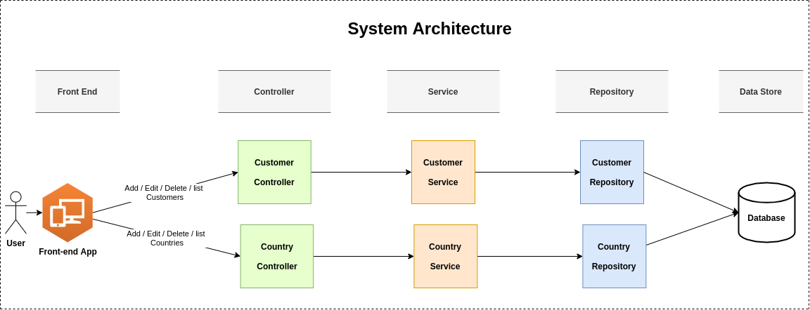
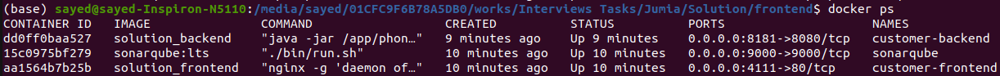

# Customer International Phone Numbers
CRUD operations for customers with the implementation of a basic business logic related to the validation of international phone numbers and SQLite 3 database.

## Table of contents
* [Requirements](#requirements)
* [Architecture](#architecture)
* [Technologies](#technologies)
* [Getting Started](#getting-started)
* [Running the project using Docker and Docker Compose](#running-the-project-using-docker-and-docker-compose)
* [Running the project for Development](#running-the-project-for-development)
* [About me](#about-me)
* [Acknowledgments](#acknowledgments)

## Requirements
Create a single page application in Java (Frameworks allowed) that uses the provided database (SQLite 3) to list and categorize country phone numbers.

Phone numbers should be categorized by country, state (valid or not valid), country code and number.

The page should render a list of all phone numbers available in the DB. It should be possible to filter by country and state. Pagination is an extra.

**Topics to take into account**:
- Try to show your OOP skills
- Code standards/clean code
- Do not use external libs to validate the numbers.
- Unit Tests

## Architecture
The next diagrams shows the system architecture:



**The REST APIs Service follows the REST architectural style**:

 1. **Controller:** is the presentation layer where the end points are located.
 2. **Service:** is the service layer where the business logic resides.
 3. **Repository:** is the persistence layer where the CRUD repository is located.

## Technologies

### Backend:

1. Java 11
2. Spring Boot

	+ Web
	+ Data JPA
	+ validation
	+ test
	+ Actuator
3. Lombok
4. Maven Dependency Management
5. SQLite 3 database
6. Swagger 2
7. sonarqube
8. Docker

### Frontend:
- Angular

## Getting Started

### Running the project using Docker and Docker Compose
The project includes [*docker-compose.yml*](docker-compose.yml) file, frontend app has [*Dockerfile*](./Frontend/Dockerfile) file, and backend app has [*Dockerfile*](./Backend/Dockerfile) file, so you can use `Docker Compose` to start up the application with required softwares. No installation needed.

#### Prerequisites
You need to install:
* [Docker](https://docs.docker.com/engine/install/) 
* [Docker-compose](https://docs.docker.com/compose/install/)

#### Clone the project
Clone the project from `github` using the following `git` command at console:

```bash
git clone https://github.com/SayedBaladoh/Customers-PhoneNumbers-SQLite3-CRUD.git
```

#### Run the project
- You can start the project using the below `docker-compose` command in the console at the project root directory:
 
```bash
cd Customers-PhoneNumbers-SQLite3-CRUD/

docker-compose up
```

- Run without display logs:

```bash
docker-compose up -d
```

- In case of any changes, rebuild the image:

```bash
docker-compose up -d --build
```

- In the end, you can **verify** whether the project was started by running in the console:

```bash
docker ps
```

You should see the following running containers:




Sonarqube, Customer Management Frontend and Backend are UP and RUNNING

#### Access the application

##### Backend
Backend application will start on port `8181`, So you'll be able to access it under address `http://localhost:8181`.
	
- To view `details` about the backend application: [http://localhost:8181/actuator/info](http://localhost:8181/actuator/info)
- For `Check Health`: [http://localhost:8181/actuator/health](http://localhost:8181/actuator/health)
- To access `Swagger` documentation to view the available Restful end-points, how to use and test APIs: [http://localhost:8181/swagger-ui.html](http://localhost:8181/swagger-ui.html)

##### Frontend
Front application will start on port `4111`, So you'll be able to access it under address [http://localhost:4111](http://localhost:4111).


### Running the project for Development 

These instructions will get you a copy of the project up and running on your local machine for development and testing purposes.

#### Clone the application

```bash
git clone https://github.com/SayedBaladoh/Customers-PhoneNumbers-SQLite3-CRUD.git

cd Customers-PhoneNumbers-SQLite3-CRUD/
```

#### Running Backend using Maven

These instructions will get you the `backend` project up and running on your local machine for development and testing purposes. See deployment for notes on how to deploy the project on a live system.

##### Prerequisites

You need to install the following software:

 * Java 11+

 * Maven 3.0+

##### Installing

Steps to Setup the project:

1. **Goto to the Backend application**

```bash
cd Backend/
```

2. **Change application configs as you want**

	 If you want to change the application configs:

	+ open `src/main/resources/application.properties` file.
	+ change the configs.

3. **Run the tests**

	You can run the automated tests by typing the following command:

	```bash
	mvn clean
	mvn test
	```
4.  **Generate Code coverage Analysis Report with Jacoco and Sonarqube**

	Type the following command on the command line with path to the root of this project:

	```bash
	mvn clean install sonar:sonar 
	```

	Wait until build process has finished.

	After getting a Build Success message, There are two link for you to open sonarqube on browser. click that link and automatically open your browser.
	
	Or go to localhost:9000 on the Web Browser and Click on the Project Name to see the detailed report.
	
5. **Run the application**

	You can run the spring boot application by typing the following command:

	```bash
	mvn spring-boot:run
	```

	The server will start on port `8080` by default, So you'll be able to access the complete application on `http://localhost:8080`. 
	If you changed the port in  `src/main/resources/application.properties` file, use your custom port `http://localhost:port`.

6. **Package the application**

	You can also package the application in the form of a `jar` file and then run it:

	```bash
	mvn clean package
	java -jar target/phone-numbers-0.0.1-SNAPSHOT.jar
	```

##### Access the Backend application

To access the backend application use the following end-points:

- **Metrics to monitor the application**

	+ View availble metrics `http://localhost:8080/actuator/`

	+ View application info `http://localhost:8080/actuator/info`
	
	+ Health check `http://localhost:8080/actuator/health`

- **REST APIs Documentation: Swagger UI**

	Use Swagger to view and test the available Restful end-points.

	+ `http://localhost:8080/swagger-ui.html`

#### Running Frontend

These instructions will get you the `frontend` project up and running on your local machine for development and testing purposes.

##### Prerequisites

You need to install the following software:

 * Node.js
 * npm package manager
 * Angular

Follow this link for [Setting up the local environment  for Angular development using the Angular CLI](https://angular.io/guide/setup-local)

#### Installing

Steps to Setup the project:

1. **Goto to the Backend application**

```bash
cd Frontend/
```

2. **Change the baseUrl for Backend service**

	+ open `src/app/services/customer.service.ts` file.
	+ change the `baseUrl` const.
	
3. **Run Frontend**

	You can run the frontend by typing the following command:

	```bash
	ng serve
	```
##### Access the Frontend application

To access the frontend application use the `http://localhost:4200/` url.

## About me

I am Sayed Baladoh - Phd. Senior / Technical Lead Software Engineer. I like software development. You can contact me via:

* [LinkedIn](https://www.linkedin.com/in/SayedBaladoh/)
* [Mail](mailto:sayedbaladoh@yahoo.com)
* [Phone +20 1004337924](tel:+201004337924)

_**Any improvement or comment about the project is always welcome! As well as others shared their code publicly I want to share mine! Thanks!**_

## Acknowledgments

Thanks for reading. Share it with someone you think it might be helpful.
